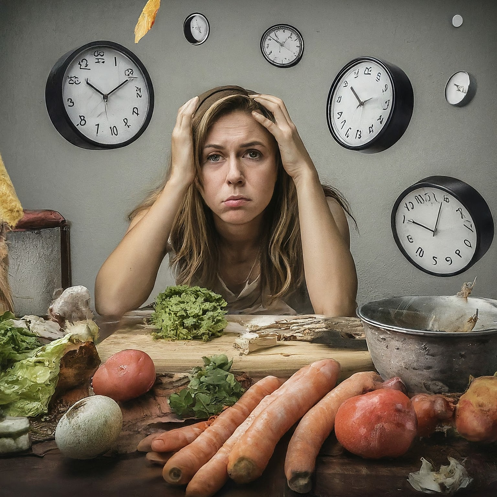
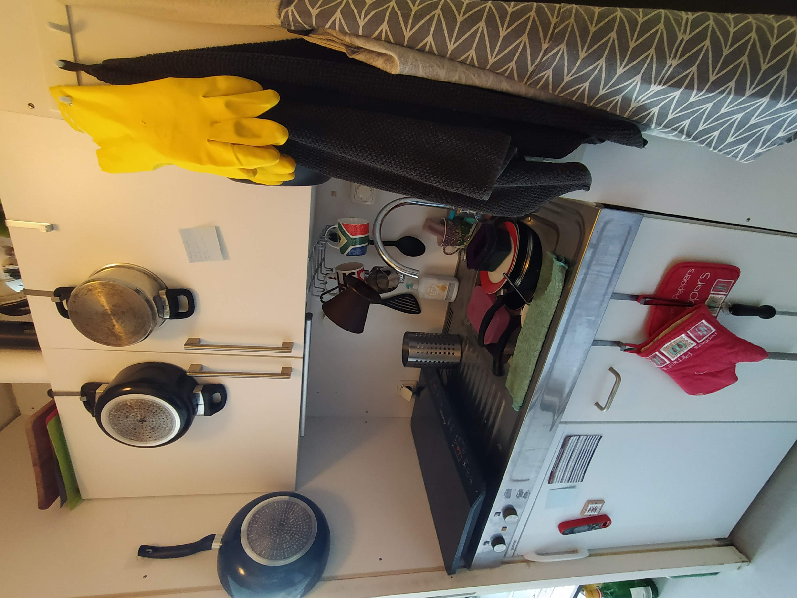

I do cook almost every day and now it's just a habit for me. I think it's an essential skill to have a healthy and an intentional life in modern times. 

But let's face it, it isn't particularly fun, at least in the beginning. But equipped with the knowledge and with the right adjustments it is possible to make it fun and **make it a habit**.

I've watched countless YouTube videos from veteran foodtubers, and food scientists. I've cooked in tiniest dorm kitchens, and read food books to self-proclaim myself to be a "home cook". Here I'll try to break down why I think cooking is an important skill and a habit to acquire, and share what helped me to form the habit.

  
  
My dorm kitchen

### Why cook?

For me the very first reason why cooking matters is to **have control over what I'm eating**. 

I know that unless I make intentional choices I will stick to what's easily available. While these options may be the most convenient at that moment, they are usually not the healthiest, and nutritionally dense.

The food cooked in restaurants is not optimized for your health and nutritional needs, but to taste good and cost less (be profitable). This, unfortunately, sometimes entails using low quality ingredients, and usually high sugar and fat, and less proteins and veggies. 

I guess I don't need to convince many about the benefits of cooking but rather how to do this. Cooking is obviously time consuming and if you don't make things easier for your lazy self, you'll often find yourself throwing a pizza in the oven or ordering a delivery. We need to make use of life hacks so that things will be easier for the lazy self and we don't even need to decide if we'll cook or not, it will just happen.

### How to cook more

TLDR; **Reduce friction**. Optimize, optimize, optimize...

Essentially what we're trying is to build a habit. A lot of what is being said and written about productivity and habit forming these days revolve around reducing friction. I also confirm with my experience that it works. Habits should be as easy as possible to avoid resistance from the "lazy self". We'll sneak the lazy self into the tasks we want to do without he/she even noticing. 

What are these in the context of cooking?

### Optimize your cooking setup:
- 👀 & 🫱:Put commonly used equipment in eye sight and to arms reach like tongues and spatulas.
- **Organize your pans**: Hang your pans or get a [pan organizer](./pan-organizer.webp). Give each pan a certain place and always put them in their place.
- **Essentials in arms reach**: Oil, salt, pepper, spices, common sauce... These should all be in arms reach and eyesight when you're prepping and cooking, which is mostly around the stovetop. Grab and pour! They should be ready for use like in spice containers and not in a messy pile of plastic packages. If you find yourself using them both around the stovetop and the workbench, buy two and put in both places.
- **Invest in equipment**: *Buy tools that will serve you, not the otherway around* . These days it's easy to find amazing kitchenware that make life easier.
	- **Pans and pots**: Get a quality set of nonstick pan of different sizes and stainless steel pans. 
  (I hear can you the cookware fundamentalists. While I love carbon steel and cast iron, I find them to be wrong options for someone trying to form a cooking habit, but something to upgrade to once you get the hang of cooking. So pick wisely.) Get stainless steel pots of different sizes. If you find yourself using a certain pan or pot more, buy another one. You don't need the most expensive ones but don't be too cheap. Every penny spent here will have a greater ROI if you cook more, even monetarily.
	- **Use the space**: Organization is key but you don't have space? Look around more carefully and look for spaces. Any empty wall, some empty space in the cabinet is ripe for hanging things or mounting shelves. A lot of the kitchen space is underutilized. Hang cooking utensils near the stovetop, use a [shelf stacker](./shelf-stacker.jpg) to stack items.
	- **Get an airfryer**: I'm serious. Get the largest one feasible. They cook super quick and are easy to clean. You'll use it much more than your oven. Of course ovens have their place but they take ages to cook common things. 
	- **Induction is the future**: Once you go [induction](https://www.youtube.com/watch?v=Xn1LUo5ra_A), there's no going back. Compared to ceramic or electric hob heating, induction stovetops make cooking much faster. It's easier to adjust heat and will give you more control in your cooking. They are more efficient because it only heats up the pan and not the whole kitchen. The stovetop glass won't get hot and burn things, and it takes just a wipe to clean. Gas is the way professionals cook but it's difficult to clean which it is a habit killer.
	- **Buy multiple**: If you're using things often, buy more of them. You have a pair of tongues you keep using? Buy another one so that you don't need to clean it immediately. The first pair can wait for the dishwasher to run while you cook with the other.
	- **Good sharp knives**: Chop chop chop! Cutting and chopping is a big part of cooking. [Practice knife skills](https://www.youtube.com/watch?v=dtEfBKJZrVQ), get a sharp knife and make chopping fun. It really doesn't cost anything to get a decent chef's knife, no need to go fancy. You'll realize you've been crushing things and not really cooking all your life. A good chef's knife and a paring knife is all you need as a cook. Optionally get multiple to clean less often. 
- **Optimize cleaning**: No one likes doing the dishes and the cleaning, so we'll max. optimize here as well.
	- **Dishwasher aggressively**: Dishwashers are modern day lifesavers. Buy dishwasher safe equipment and throw them all in. Don't clean things throughly. Just give a rinse away the chunks and if there is residue do a quick scrub with a brush. Our good friend will take care of the rest. Dishwashers can clean almost everything if you don't overfill and place things correctly. Don't wait too much to run it. It consumes much less water than you handwashing, and the electricity cost is negligible compared to the time you save.
	- **Get a spray faucet**: [Spray faucets](./spray-faucet.webp) with a flexible hose saves time and water when rinsing things. You don't need to take the dishes to the faucet, it comes to the dishes. A high faucet creates a lot of room to work with instead of a classic low one.
	- **Wipe and throw**: Get a big set of machine-washable towels and wipe workbenches with detergent/soap spray. Throw the dirty towels in a bin and only machine wash them. Don't bother handwashing. Keep your countertops free of clutter, except essentials. Again, use indiction for easy stovetop wiping.
- **Cook in bulk:** Unless the dish does not allow (e.g. burgers) always cook more than you need. Get a good set of dishwasher-safe containers. I personally have a [glass set](./glass-container.jpg) and the classic ["deli containers"](https://www.youtube.com/watch?v=TsMZDraqF9s). The nice thing about deli containers are they are dishwasher, freezer and microwave safe, and they stack really nicely with the same lid. And BTW, get a microwave and heat the leftovers.
- **Level up your pantry game:** Your pantry should always be ready to cook something delicious, even if your fridge is empty. These are things with longer shelf life so we'll stack these in our arsenal.
	- Pantry essentials: Various dried pasta, rice, canned and dried legumes, canned vegetables, tomato puree, coconut milk. Flour, starch, sugar, honey... Anything that has +6 months shelf like. 
	- A neutral oil (sunlower, canola, peanut etc.) and olive oil, neutral vinegar and balsamic. 
	- Sauces like soy sauce, sirracha, ketchup, mayo, mustard, tabasco
	- Have lemon and lime in the fridge. 
	- Keep in hand garlic, onions and potato. 
	- Collect spices: chilli, cumin, garlic powder, turmeric, thyme, oregano. Get a black pepper mill (multiple if needed)
	- Keep frozen veggies, herbs, fish & shrimp. 
	
### Learn the science 

Every kitchen is a small chemistry lab. The key to cook deliciously is to understand what's going on in your pan and use it to your advantage. Once you get some basics, you'll turn any random stuff into something delicious! If you understand the basics, you'll never have to follow a recipe word by word.

## How to cook healthy

All of it comes down to one thing: **don't buy junk**. You don't have to buy the greenest greens and ripest avocados. Just don't buy chips, pizza, nuggets, fries, cookies, sweets... You know the deal. 

Snacking can play a big role here. Stick to larger meals and try to not snack all the time. Replace junk with healthy stuff. Put fruits in eye sight. Unprocessed nuts are good but be careful with the amount. They are calorie dense and it's easy to go overboard with them. Hydrate well. You'll see you just need to keep your hands moving and stomach filled with anything and not eat all the time.

If you're a drinker, watch out alcohol. Don't drink alone. Don't keep beer and wine at home, only buy when you really want to drink. Try to replace alcoholic beverages with water with gas, sugar-free drinks, tea, or decaf coffee. 

Don't try too hard to cook "healthy healthy" things. Every now and then reward yourself with a nice burger or a nice steak. Unless you fry every day, you'll eat healthy by default, believe me.

I generally walk in to the supermarket and buy couple meat, chicken, or fish; pick up some veggies and fruits in season and that I like, and those will be things I eat the next days. Buy whole food. Only buy things you want to eat. Don't buy junk.

## For more

A lot of this I've learned over time by following these amazing people and just watching their 10-20 min videos while eating. Talk about compounding! The more I cook and eat the more I learn. At one point I started to look forward to cook and eat to just watch videos. These people are amazing content creators.

One caution is to not get stuck with only the most recent videos. The nature of being a YouTuber is to constantly find something to talk about, unfortunately. Which leads to [burnout](https://www.youtube.com/watch?v=NS1H3hozE4w). But, most of the content created by these people are evergreen. Actively look for those. (In recommended order:)
- [Adam Ragusea](https://www.youtube.com/@aragusea)
- [Ethan Chlebowski](https://www.youtube.com/@EthanChlebowski)
- [J. Kenji Lopez-Alt](https://www.youtube.com/@JKenjiLopezAlt)
- America's Test Kitchen
	- [What's Eating Dan](https://www.youtube.com/watch?v=tn94d4ms8FI&list=PLnbzopdwFrnZc-UgGYETAQair7VzS7_Z8)
	- [Techniquely by Lan](https://www.youtube.com/watch?v=BtLcD_fFmpA&list=PLnbzopdwFrnYyvwrqTB_5AhufdOMisGnF)
  - [Gear Heads](https://www.youtube.com/watch?v=st6LggwoL_4&list=PLnbzopdwFrnbt5uZx46gvyskyu41z7hlQ)
- [MinuteFood](https://www.youtube.com/@MinuteFood)
- [Food Wishes (Chef John)](https://www.youtube.com/@foodwishes)
