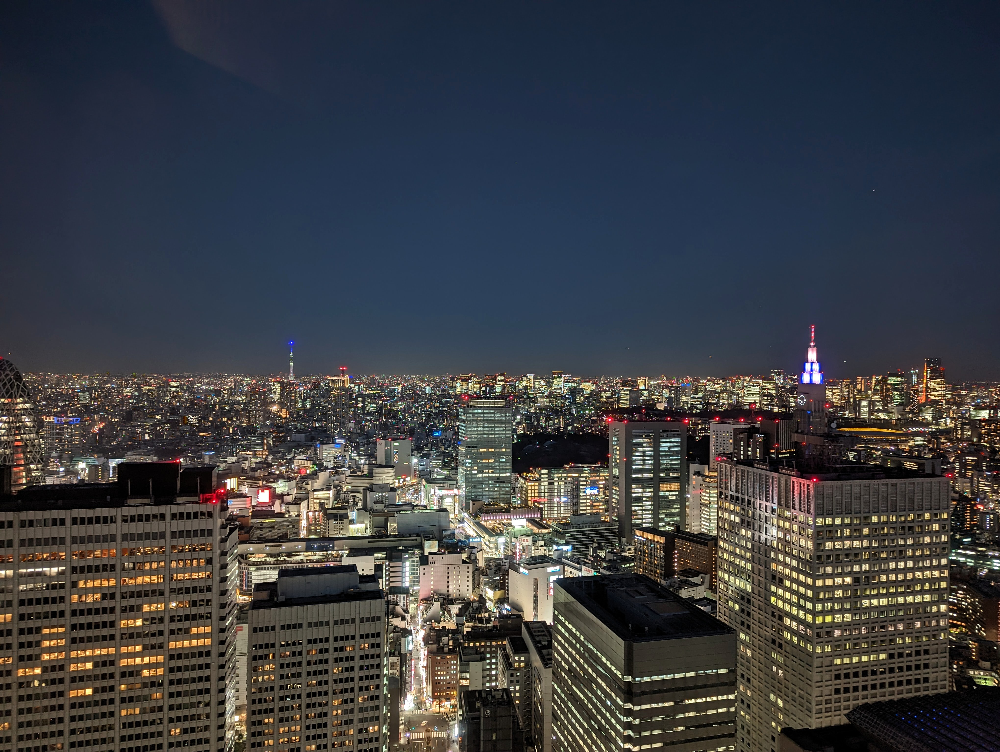
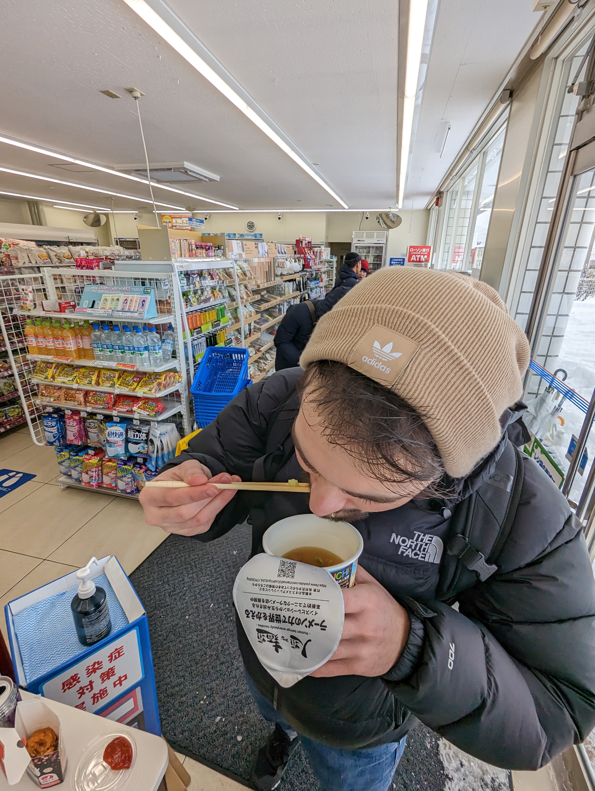

I recently went to Japan for two weeks and had an amazing time. It consisted of a week in Hakuba for skiing/snowboarding 🏂, 2 days in Kyoto, and 4 days in Tokyo. For the friends and for the rest of the internet, here are my fav places to eat, drink, and visit. This will not include the obvious tourist attractions and information you can find on any travel blog. Search for "Japan/Tokyo/Kyoto travel blog" and read few of them. You'll find the real gems in reddit. Search "Places to eat Tokyo reddit" or about anything else you're interested in. I've found the best recommendations on reddit.

# Tokyo

- Be praperd to walk! You will walk a lot in general, and between stations. Google maps is your friend. Follow the the instructions where to exit otherwise you'll get lost. There are many exits far away from each other.

- Watch people lose money in a huge [arcade shop](https://www.youtube.com/watch?v=O-rBhEsU8NI).

- In a typical nightout you'll catch either of these two trains: The last train (Around 00:00) or the first train home (around 05:00). Otherwise be prepared to pay for a taxi. It can get expensive and the distances are long.

- Come with an empty suitcase. Clothing is cheaper than in Europe or US. If you're a Uniqlo fan like me you'll love it. But not only that, all brands have flagships stores with good prices. You can get tax free everywhere. Carry your passport with you.

- Avoid Roppongi: Many people say Roppongi is a nice place to go out but the first night (Friday) we were staying there the bars we went were not fun, and overall not much was going on in the neigborhood. On our last Saturday we went to a bar/club called R2 Supper Club and it was full of rich expats showing off. Crowded. No one's dancing for fun. Not my vibes.

- Free walking tour from Tokyo Localized

  - Avoid the ["Flagship" Akihabara tour](https://www.tokyolocalized.com/free-walking-tour). There isn't much to see around here.
  - Don't miss the ["Shinjuku Night Tour"](https://www.tokyolocalized.com/shinjuku-night-free-walking-tour). We had a guide named Zac and he has explained sooo many things about the life and nightlife in Japan. He was incredibly knowledgable and the hours flew by. You'll learn about customs and a typical nightout in Japan, "maid bars", "night food", "love hotels"... It ended at the cool Golden Gai district we grabbed a drink with our fellow toursters, ending with night food at Omoide Yokocho (food street). DO NOT MISS THIS TOUR.

- [Tokyo Metropolitan Government Building](https://goo.gl/maps/rKjQZMVqk1crbhL78) free observation deck with amazing views. Go at sunset.

- TeamLab Planet: An exhibition somewhere between being too instagrammable and a nice experience. I tend towards the latter and think it was worth the visit, despite the high price. Just don't forget to put your phone down and immerse.

- [Atom Tokyo](https://goo.gl/maps/PKLppvguqa9SZLp27) Nightclub: A more EDM nightclub we went twice. Mostly for younger people but it was fun and full of warm locals.

- [Moriichi](https://goo.gl/maps/Agdk5QxNiEA7bxuE6): Decent conveyor belt sushi for good price.

# Kyoto

- Do [this](https://www.guruwalk.com/walks/35100-kyoto-free-walking-tour-main-tour) free walking tour. Our guide was an amazingly enthusiastic and knowledgable Swedish guy. I'm hoping you'll get the same guide.

- [Yakiniku Hiro](https://yakiniku-hiro.com/english/): Kyoto chain known for its yakiniku (bbq). Good prices for decent wagyu. The purple marked restaurants on the website are more expensive.

- [Prince Smart Inn](https://goo.gl/maps/mQy1nFAZnALbkVGh9) hotel if you're looking for a cheap stay. We paid 15 eur a day per person. Clean, central, and with a breakfast. Too good to be true.

# General Advice

- Try out vending machines. They're cheap and literally everywhere. Look for the red stickers for hot drinks.

- Max. utilize the convenience stores: Eat a lot of onigiri, buns, grab drinks. I liked high alcohol "Chuhai"s. Don't forget to try the Lawson egg sandwich, [Anthony Bourdain's shameful vice](https://www.youtube.com/watch?v=v1LOiRfMc08).

- Clothing is cheap! Come with an empty suticase and buy clothes here. Uniqlo is cheaper than in Europe or US. All brands have flagships stores with good prices. You can get tax free everywhere. Carry your passport with you.

- Can't point out places in Tokyo or Kyoto but must try these:
  - Okonomiyaki (savory pancake)
  - Takoyaki (octopus balls)
  - Yakitori (grilled chicken)
  - Shabu Shabu (hot pot)
  - Oden (dishes with stewed broth)
  - Ramen, Udon noodles, obviously
  - Any street food that looks delicious.
