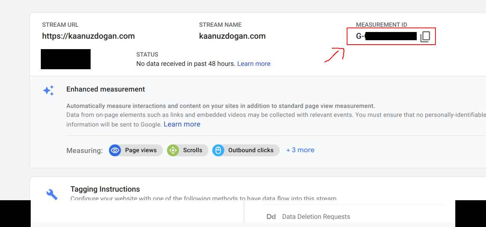

So I've just set up my website and hopefully will start blogging. During the process I encountered some difficulties and trying to set up Google Analytics was one of them. So I thought why not write the first post for this.

When setting up a blog we normally want to have some simple analytics tool integrated to see who is visiting the website. Google Analytics is the go to service, and most of the Gatsby starters come with the [GA plugin](https://www.gatsbyjs.com/plugins/gatsby-plugin-google-analytics/). 

The problem is Google seems to have changed the terminology and how things work since the GA4 update in October 2020, according to [this article](https://analyticshelp.io/blog/google-analytics-property-tracking-id/). You just cant find the **tracking id** as in the plugin docs or in any other tutorial. We use the new **measurement id** instead.

## Setup

First instead of the `gatsby-plugin-google-analytics` we will be installing `gatsby-plugin-google-gtag`. Install it by

```
npm install gatsby-plugin-google-gtag
```

Then we need the **measurement id** in our dashboard. Go to **Admin** menu in the [Analytics Console](https://analytics.google.com/) and create your website as a property if you haven't done already. If you already created it you need to go to **Data Streams**:



There you will see the **Measurement ID**. We just need that.


Then go to your `gatsby-config.js` and add the plugin config as follows:

```javascript
{
  resolve: `gatsby-plugin-google-gtag`,
  options: {
    trackingIds: [
      process.env.GOOGLE_MEASUREMENT_ID, // Google Analytics / GA
    ],
  },
},
```

We use an environment variable since we don't want to publihs our ID when we push the code to the repo. To do that we additionally need the `dotenv` library. Install it with 

```
npm install dotenv
```

if you don't have it in your project and add the following line to the top of your `gatsby-config.js`.

```javascript
require(`dotenv`).config({
  path: `.env`,
})
```

And to add the key, create a file name `.env` at the root of your project directory and add the Measurement ID in following line:

```
GOOGLE_MEASUREMENT_ID=G-XXXXXXXXXX
```

## See it in action

To check if it's working you need to build the project. It won't work when you `gatsby develop`. Instead execute

```
gastby build && gatsby serve
```

Go to [localhost:9000](localhost:9000) and click the **Realtime** in the Google Analytics console menu on the left. When you refresh below you should see yourself in the statistics.

Alternatively you can connect with another device (e.g. mobile) if you serve the website in your local network. Instead of the command above, execute 

```
gatsby serve --host 0.0.0.0
```

This will accept connections from all network interfaces including Wireless LAN. You need to be connected to the same network in your phone as your computer. Now head to [localhost:9000](localhost:9000) in your phone. You should see 2 devices online.


And there you go! You've successfully integrated Google Analytics to your Gatsby site.